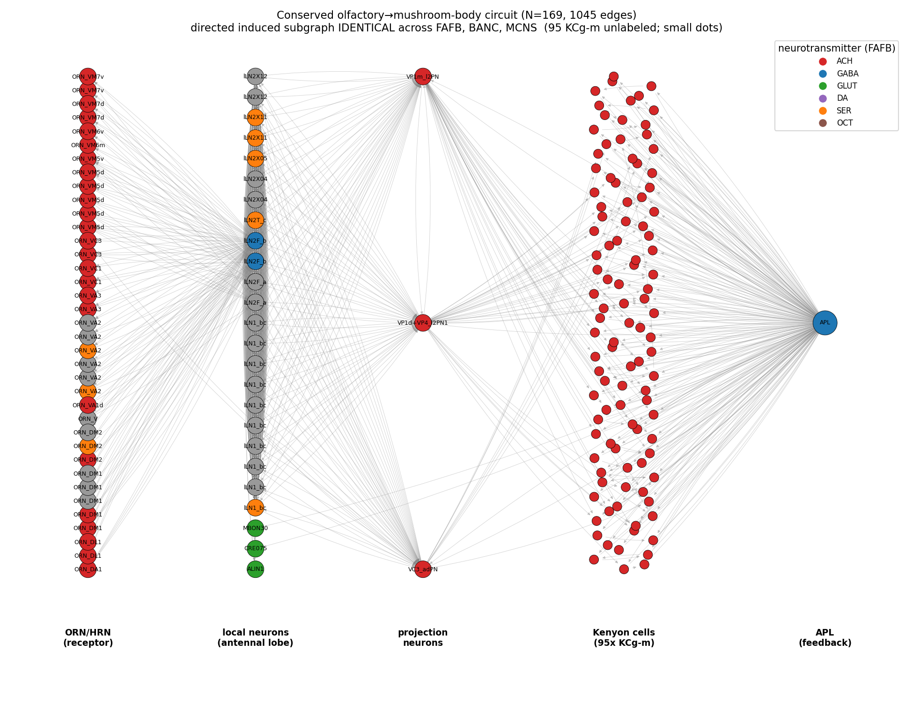
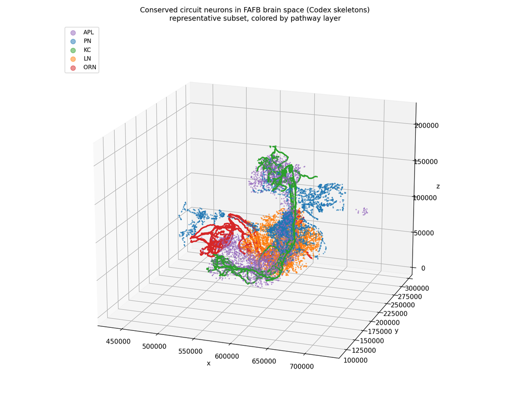

# A Sex- and Region-Invariant Olfactory → Mushroom-Body Circuit

### Conserved across FAFB, BANC, and MCNS

## Summary

I identified a directed induced subgraph of 169 neurons and 1,045 edges that is exactly isomorphic across three *Drosophila* connectomes: FAFB v783, BANC v626, and MCNS v0.9 (Dorkenwald et al. 2024; Schlegel et al. 2024). The adjacency matrices are byte-identical, VF2 confirms the isomorphism, and all 169 matched neurons share the same cell type across datasets. The circuit is the canonical olfactory associative-memory pathway of the mushroom body (Li et al. 2020), conserved across sex and CNS region. A type-constrained null and a label-shuffle control confirm the wiring is not reproducible by chance (p < 10⁻⁴; methods in the README). The biology below is anchored on FAFB v783, the curated dataset.

## What the circuit does

The neurons form the pathway ORN/HRN → antennal-lobe PN/LN → Kenyon cells ↔ APL feedback. Olfactory receptor neurons converge by glomerulus, projection neurons relay to the mushroom body, and Kenyon cells encode odors sparsely, each sampling input from only a few projection neurons (Li et al. 2020). APL, a single large GABAergic neuron, supplies global feedback inhibition that enforces this sparseness and decorrelates odor codes, which is required for selective associative learning (Lin et al. 2014; Amin et al. 2020).

*Figure 1. The conserved circuit as a directed network graph, identical across FAFB, BANC, and MCNS. Nodes colored by neurotransmitter, arranged by pathway layer.*

| Layer | Example cell types | n |
| --- | --- | --: |
| Sensory | ORN_*, HRN_VP4 | 37 |
| Antennal-lobe LN | lLN1_bc, lLN2F/T/X, ALIN1 | 23 |
| Projection | VP1m_l2PN, VP1d+VP4_l2PN1, VC3_adPN | 3 |
| Memory | KCg-m, KCab-p, KCg-d | 103 |
| Feedback | APL | 1 |
| MB-associated | MBON30, CRE075 | 2 |

## Structural and functional observations

The neurotransmitters are coherent: a cholinergic ORN → PN → KC feedforward spine, GABAergic and serotonergic local-neuron inhibition, a single GABAergic APL, and glutamatergic MBON30 and CRE075. APL is the highest-degree node (108 incoming, 106 outgoing) and forms 448 reciprocal pairs with the Kenyon cells, the structural basis of the feedback loop. The sensory layer is multimodal: it includes a hygrosensory receptor neuron (HRN_VP4) and thermo- and hygrosensory VP projection neurons converging with olfactory projection neurons (Marin et al. 2020). The motif also holds population-wide, not just in the matched subgraph: across the full connectomes, P(PN → KCg-m) is 0.023 to 0.031, APL → KCg-m coverage is 0.89 to 1.00, and KCg-m → APL coverage is 0.70 to 1.00, and these agree across all three datasets, even though individual PN to KC partners vary between animals (Caron et al. 2013). MBON30 and CRE075 are matched but here project into APL, so they do not form a Kenyon-cell readout stage.

*Figure 2. Circuit neurons rendered from Codex 3D skeletons in FAFB, colored by pathway layer.*

## Hypothesis and interpretation

I hypothesize that the ORN → PN/LN → KC ↔ APL motif is a conserved computational primitive for associative learning: relay sensory input, sparsen it in the Kenyon-cell layer, and regulate it by global feedback inhibition. Its conservation across sex, body region, and reconstruction pipeline, together with the variable PN to KC partners, suggests a stabilized template in which the computation is fixed but its specific instances are not. A structural-only search finds a 37-neuron isomorphism with 0 of 37 shared cell types, so exact topology alone does not establish homology. Combining exact structural conservation with cell-type conservation is what makes this a genuine conserved circuit rather than a coincidence.

Data note: the edge lists carry no synapse weights, so I use every directed connection as provided, drop self-loops, and collapse duplicate pairs. Some BANC and MCNS labels are predicted; FAFB is curated.

## References

1. Dorkenwald et al. (2024) Nature 634:124. 2. Schlegel et al. (2024) Nature 634:139. 3. Li et al. (2020) eLife 9:e62576. 4. Lin et al. (2014) Nature Neuroscience 17:559. 5. Caron et al. (2013) Nature 497:113. 6. Amin et al. (2020) eLife 9:e56954. 7. Marin et al. (2020) Current Biology 30:3167.
